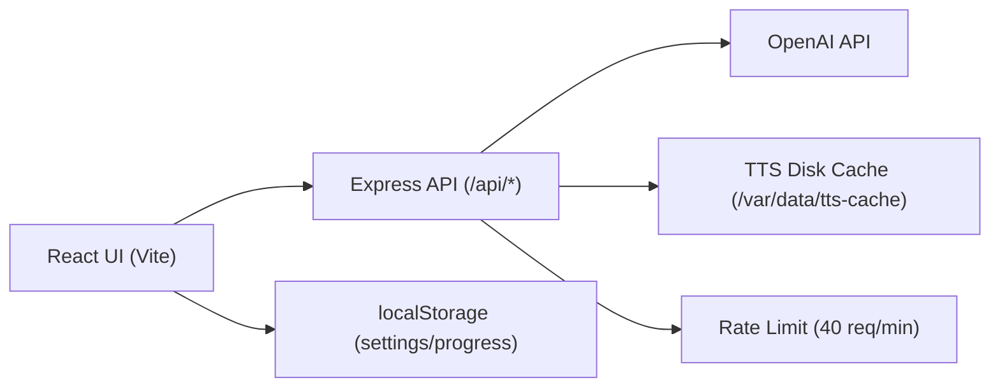

# Vokabeltrainer (React + Express + OpenAI)

Interaktiver Vokabeltrainer fuer Klassen 5-7 mit Text-Quiz, Spracheingabe (STT), Vorlesen (TTS), Beispielsatz-TTS und persistentem TTS-Cache.

## Funktionsuebersicht

### Quiz
- Klassenwechsel: `Klasse 5`, `Klasse 6`, `Klasse 7`
- Abfragerichtungen:
  - `en-de`
  - `de-en`
  - `mixed`
  - `irregular` (unregelmaessige Verben)
- Seitenweise Lernen mit Fortschrittsanzeige pro Seite
- Automatischer Wechsel der Richtung, wenn in einer Richtung bereits alle Woerter erledigt sind
- Loesung anzeigen / naechstes Wort
- Mobile: Action-Button-Labels (`Check!`, `Loesung zeigen`, `Weiter`) sind nicht markierbar
- Mobile: Querformat ist deaktiviert (Landscape zeigt einen Hinweis zum Drehen ins Hochformat)
- `Tafel-Modus` fuer manuelle Richtig/Falsch-Bewertung
- `Retry` pro Seite
- Fortschritts-Reset (`Neu anfangen`) mit Bestaetigungsdialog
- Visuelles Feedback:
  - Gruen/Rot-Status am Input
  - Fireworks-Effekt bei Seitenabschluss

### Audio / Sprache
- `Vorlesen` Button: spricht das aktuelle Wort
- `Beispielsatz` Button: generiert kurzen Beispielsatz und spricht ihn
- Spracheingabe per Mikrofon (`hold-to-record`):
  - gedrueckt halten -> aufnehmen
  - loslassen -> transkribieren + Antwort pruefen
  - uebermittelte STT-Sprache wird vor Upload auf `de` oder `en` normalisiert
- Fehlermeldungen fuer Playback-/Mikrofon-/STT-Fehler
  - werden unten fuer ca. 10 Sekunden angezeigt
  - technische Browser-Permission-Texte (z.B. iOS User-Agent-Meldungen) werden nicht angezeigt

### Persistenz
- Pro Klasse persistierte Einstellungen und Fortschritte in `localStorage`
- Aktive Klasse wird gespeichert
- Backward-Compatibility fuer alte (ungescopte) `class5` Keys

## Architektur



### Frontend
- Einstieg: `client/App.jsx`
- Quiz-Orchestrierung: `client/hooks/useQuizController.js`
  - State: `useQuizState`
  - Actions: `useQuizActions`
  - Persistenz: `useQuizPersistence`
  - Status-Flash: `useQuizStatusFlash`
- Audio:
  - TTS Playback: `client/hooks/audio/useSpeechPlayback.js`
  - STT Aufnahme + Upload: `client/hooks/audio/useSpeechInput.js`
- Komponenten:
  - Header/Navigation: `client/components/Header.jsx` + `client/components/header/*`
  - Fragekarte: `client/components/QuestionCard.jsx`
  - Antwort-/Mikrofonbereich: `client/components/question/AnswerInputSection.jsx`
  - Vorlesen/Beispielsatz: `client/components/question/QuestionPrompt.jsx`

### Backend
- Server/Boot: `server/index.js`
  - JSON body limit: `1mb`
  - Audio rate limit: `40` Requests / `60s` auf `/api/tts` und `/api/stt/check`
- Routen:
  - Health: `server/routes/health.js`
  - TTS: `server/routes/tts.js`
  - STT: `server/routes/sttCheck.js`
- OpenAI Integration:
  - Client: `server/openai/client.js`
  - TTS: `server/openai/synthesizeVocabulary.js`
  - Beispielsatz-Generierung: `server/openai/generateExampleSentence.js`
  - STT: `server/openai/transcribeAndNormalizeAnswer.js`

### TTS Cache Architektur
- L1: In-Memory Cache (`Map`) im Node-Prozess
- L2: Persistenter Disk-Cache via `server/cache/ttsDiskCache.js`
  - Audio-Dateien: `TTS_CACHE_DIR/audio/*.mp3`
  - Metadaten: `TTS_CACHE_DIR/meta/index.json`
- In-Flight-Dedupe:
  - Gleiche parallele Requests teilen sich denselben Upstream-Call
- TTL:
  - Vocabulary Audio: 30 Tage
  - Example Audio: 7 Tage
  - Example Sentence (Text): 7 Tage
- Schreibschutz:
  - Atomare Writes (`.tmp` -> `rename`)
  - Serialisierte Meta-Updates via Write-Queue

Details: siehe `CACHE.md`.

## API

### `GET /api/health`
- Antwort: `{"status":"ok"}`

### `POST /api/tts`
- Body (JSON):
  - `text` (string, 1..120)
  - `language` (`de` | `en`)
- Antwort:
  - `200` mit `audio/mpeg`
- Header:
  - `X-Cache`
  - `X-TTS-Audio-Cache`

### `POST /api/tts/example`
- Body (JSON):
  - `text` (string, 1..120)
  - `language` (`de` | `en`)
- Ablauf:
  - Beispielsatz generieren
  - Beispielsatz als MP3 synthetisieren
- Antwort:
  - `200` mit `audio/mpeg`
- Header:
  - `X-Cache`
  - `X-TTS-Audio-Cache`
  - `X-TTS-Sentence-Cache`

### `POST /api/stt/check`
- Body: `multipart/form-data`
  - `audio` (Datei, max 5MB)
  - `language` (`de` | `en`)
    - Client normalisiert den Sprachwert auf `de`/`en` (`deutsch`/`english` Aliase werden akzeptiert, sonst Fallback `en`)
- Antwort:
  - `200`: `{ transcript, answer }`
  - `400`: ungueltige Payload / ungueltiges Audio
  - `500`: Upstream-/Serverfehler

## Datenmodell

- Vokabeldaten liegen statisch in `client/data/*.json`
- Normalisierte Datasets entstehen in `client/data/index.js`:
  - `vocabData` (seitenbasiert)
  - `irregularData` (unregelmaessige Verben)

## Environment Variablen

Backend-relevant:
- `OPENAI_API_KEY` (pflicht)
- `OPENAI_TTS_MODEL` (optional, default `gpt-4o-mini-tts`)
- `OPENAI_STT_MODEL` (optional, default `gpt-4o-mini-transcribe`)
- `OPENAI_TEXT_MODEL` (optional, default `gpt-4o-mini`)
- `TTS_CACHE_DIR` (optional, default `/tmp/tts-cache`; in Render via Terraform auf `/var/data/tts-cache`)

Wichtig:
- OpenAI Secrets niemals ins Frontend (`VITE_*`) legen.

## Lokal entwickeln

### Setup
1. `npm ci`
2. `.env` im Projektroot anlegen (mindestens `OPENAI_API_KEY`)

Beispiel:

```bash
OPENAI_API_KEY=sk-...
OPENAI_TTS_MODEL=gpt-4o-mini-tts
OPENAI_STT_MODEL=gpt-4o-mini-transcribe
OPENAI_TEXT_MODEL=gpt-4o-mini
TTS_CACHE_DIR=/tmp/tts-cache
```

### Start
- Komplett: `npm run dev:full`
- Nur Frontend: `npm run dev` (Port 5173)
- Nur Backend: `npm run dev:server` (Port 10000)

### Qualitaet
- Lint: `npm run lint`
- Tests: `npm run test`
- Full check: `npm run check`

### Build / Prod-Start
- Build: `npm run build` (Output `dist`)
- Start: `npm run start` (serves API + statische App)

## Deployment

### Render (Blueprint)
- Config: `render.yaml`
- Build Command: `npm ci && npm run build`
- Start Command: `NODE_ENV=production npm run start`
- Default Service-Name: `vokabeln-app` (bei Neuerstellung ergibt das i.d.R. die URL `https://vokabeln-app.onrender.com`; bei bestehenden Services bleibt der bestehende `onrender.com`-Slug erhalten)
- Mindestens setzen:
  - `OPENAI_API_KEY`
- Optional setzen:
  - `OPENAI_TTS_MODEL`
  - `OPENAI_STT_MODEL`
  - `OPENAI_TEXT_MODEL`

### Render via Terraform
- Infra: `infra/render`
- Provisioniert:
  - Web Service
  - Persistent Disk (default 1GB, `/var/data`)
  - Env Vars inkl. `TTS_CACHE_DIR` und `OPENAI_TEXT_MODEL`
- Anleitung: `infra/render/README.md`

## TTS Cache Debug (curl)

Die TTS-Endpunkte liefern Cache-Header:
- `X-Cache` (`HIT` | `MISS`)
- `X-TTS-Audio-Cache` (`memory` | `disk` | `openai`)
- `X-TTS-Sentence-Cache` (nur `/api/tts/example`)

Lokaler Test (Server auf Port `10000`):

```bash
# 1) Vorlesen
curl -s -D - \
  -H "Content-Type: application/json" \
  -X POST http://localhost:10000/api/tts \
  -d '{"text":"Haus","language":"de"}' \
  -o /tmp/tts-vocabulary.mp3 | grep -i -E 'x-cache|x-tts-'

# 2) Gleiches nochmal (typisch: HIT)
curl -s -D - \
  -H "Content-Type: application/json" \
  -X POST http://localhost:10000/api/tts \
  -d '{"text":"Haus","language":"de"}' \
  -o /tmp/tts-vocabulary-2.mp3 | grep -i -E 'x-cache|x-tts-'

# 3) Beispielsatz
curl -s -D - \
  -H "Content-Type: application/json" \
  -X POST http://localhost:10000/api/tts/example \
  -d '{"text":"Haus","language":"de"}' \
  -o /tmp/tts-example.mp3 | grep -i -E 'x-cache|x-tts-'
```
